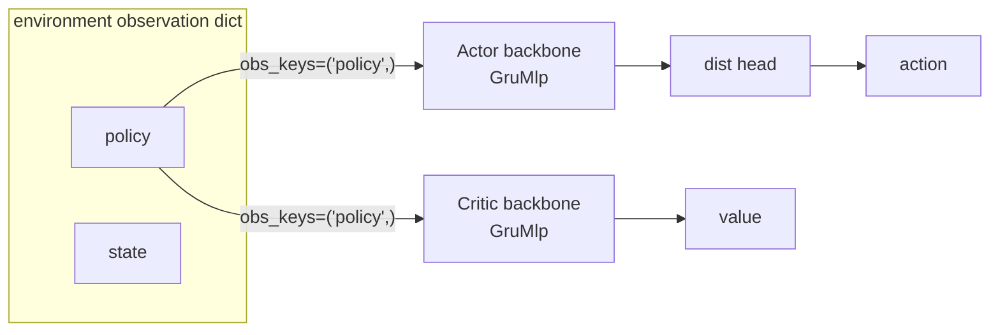

# Agents & algorithms

<span class="dx-eyebrow">Thunder</span>

With the pipeline covered, we now pack it into something that can "run itself." In Thunder that something is the `Algorithm`, and an `Agent` is its specialization in the reinforcement-learning setting: **Agent = models + an environment-interaction strategy + a pipeline for learning.**

## Algorithm: hold a pipeline, step it repeatedly

`Algorithm` is the base class of all algorithms. It holds `models`, an `executor`, a `ctx`, and a `pipeline`, exposing three actions:

| Method | Role |
| --- | --- |
| `build(optim_config)` | builds the `ExecutionContext` (with optimizer groups) via `executor.init(models, optim_config)`; the algorithm becomes runnable |
| `setup_pipeline(pipeline)` | attaches a chain of Operations (or a Pipeline) and triggers contract validation |
| `step()` | runs the pipeline once: `self.ctx, metrics = self.pipeline(self.ctx)`, increments the step, returns the metrics dict |

```python
def step(self, batch=None) -> Dict[str, Any]:
    if self.ctx is None:
        raise RuntimeError("Algorithm not built. Please call .build() first.")
    self.ctx = self.ctx.replace(batch=batch)
    with self.ctx.manager:                       # enter mixed-precision / distributed context
        self.ctx, metrics = self.pipeline(self.ctx)
    self.ctx = self.ctx.replace(step=self.ctx.step + 1)
    return metrics
```

The training script's main loop is just repeated `agent.step()` — one step runs the whole "collect → compute → optimize" pipeline and returns `metrics` straight to the logger. **All algorithm state lives in `self.ctx`**, and `step` merely advances it one notch along the pipeline.

## Agent: models + strategy + pipeline

`Agent` subclasses `Algorithm`, adds a `buffer`, and fills in the strategy methods for "talking to the environment." These methods are the callbacks the `Rollout` / `Play` operators invoke while collecting:

| Method | What it does |
| --- | --- |
| `act(obs, explore=True)` | collection: computes action + log_prob + value, writes them into the current transition `self.t` |
| `infer(obs, explore=False)` | evaluation: emits action only, no value, no trajectory bookkeeping |
| `collect(**kwargs)` | fills next_obs/rewards/terminated/timeouts into the transition, `buffer.add_transition` |
| `reset(dones)` | zeroes the recurrent carry of finished environments |
| `snapshot()` | captures the current recurrent state (e.g. `policy_carry`/`critic_carry`) into the cache |

`AgentSpec` is the Agent's framework-level config (device, precision, whether to compile, whether to warm-start):

```python
@dataclass
class AgentSpec:
    name: str
    device: str = "cuda:0"
    precision: Literal["fp32", "fp16", "bf16"] = "fp32"
    compile: bool = False
    resume: str | None = None   # checkpoint path for warm-start
```

!!! note "The time axis in act and infer"
    Thunder's network backbones are sequence models (GRU+MLP by default), expecting time-axis-bearing `[N, L, ...]`. The environment yields only `[N, ...]` per step, so `act`/`infer` `unsqueeze(1)` a length-1 time axis onto each observation before the network and `squeeze(1)` it back out. The recurrent `policy_carry` / `critic_carry` is maintained across steps inside the Agent; `reset(dones)` zeroes the carry of the corresponding environments at episode boundaries.

## obs_keys: aligning observations to the network backbone

This is the mechanism that connects "what the environment provides" with "what the network wants," and the most common beginner pitfall.

The environment emits a dict of **observation groups**, e.g. `{"policy": ..., "state": ...}`. The network-side `Actor` / `Critic` each carry an `obs_keys` declaring "which groups I consume, in what order they feed the backbone":

```python
class Actor(ThunderModule):
    def __init__(self, backbone, dist, obs_keys: Tuple[str, ...]):
        self.obs_keys = tuple(obs_keys)

    def forward(self, obs: Dict[str, torch.Tensor], carry=None):
        feature, carry = self.backbone(*(obs[k] for k in self.obs_keys), carry)
        return self.dist(feature), carry
```

Note `*(obs[k] for k in self.obs_keys)` — it pulls the corresponding tensors from the observation dict **in `obs_keys` order** as positional arguments to the backbone. So:

- `obs_keys=("policy",)` (default) → the backbone eats one `policy` stream;
- `obs_keys=("policy", "state")` → the backbone eats two inputs (common in asymmetric actor-critic: the critic sees an extra privileged `state` stream).

!!! warning "Misalignment = KeyError"
    If `obs_keys` names a key the environment's observation dict does not contain, `obs[k]` raises a **`KeyError`** outright and training stops on the spot — it does not fail silently. This is deliberate: it locks "the observation groups the environment provides" to "the observation groups the algorithm consumes" by key. So when wiring up a new task, the first thing to verify is whether the task's observation-group names match your `ActorSpec.obs_keys` / `CriticSpec.obs_keys`.

### Where shapes come from: factory reads single_observation_space

You don't hand-fill the dimension of each input. `PpoAgent.factory` derives each observation group's feature shape from the environment's `single_observation_space`, then hands it to each spec's `factory` to build the network:

```python
# vector obs -> int of last dim; image obs -> (C, H, W) tuple
obs_shapes = {
    k: (s.shape[-1] if len(s.shape) == 1 else tuple(s.shape))
    for k, s in env.single_observation_space.items()
}
action_dim = env.single_action_space.shape[-1]
actor  = spec.actor.factory(obs_shapes, action_dim)
critic = spec.critic.factory(obs_shapes)
```

And `ActorSpec.factory` is exactly where shapes are picked from `obs_shapes` by `obs_keys`:

```python
def factory(self, obs_shapes, action_dim, **ctx) -> Actor:
    in_shapes = [obs_shapes[k] for k in self.obs_keys]   # order-aligned
    backbone = self.backbone.factory(*in_shapes, **ctx)
    head = self.head.factory(self.backbone.out_shape, action_dim, **ctx)
    return Actor(backbone, head, self.obs_keys)
```

Default networks: the actor backbone is `GruMlpSpec(out_shape=256, mlp_shape=())` with a `ConsistentNormalHeadSpec` distribution head; the critic backbone is `GruMlpSpec(out_shape=1, mlp_shape=(256, 128))`. Both default to seeing only `obs_keys=("policy",)`.



---

You now understand the Agent's skeleton and how obs_keys wires things up. The next page dives into the networks themselves — what models exist, how they're constructed, and how actor/critic use them: [Models & Networks →](models.en.md); after that, see PPO's real `collect → GAE → loss → optimize` pipeline brought to the ground: [PPO in practice →](ppo.en.md)
