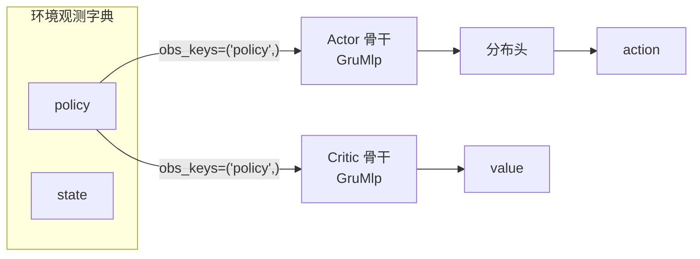

# Agent 与算法

<span class="dx-eyebrow">Thunder</span>

流水线讲完，现在把它装进一个能"自己跑"的东西。Thunder 里这个东西叫 `Algorithm`，而 `Agent` 是它在强化学习语境下的特化：**Agent = 模型 + 与环境交互的策略 + 一条学习用的 pipeline。**

## Algorithm：维护一条 pipeline，反复 step

`Algorithm` 是所有算法的基类。它内部持有 `models`、`executor`、`ctx` 和一条 `pipeline`，对外暴露三个动作：

| 方法 | 作用 |
| --- | --- |
| `build(optim_config)` | 用 `executor.init(models, optim_config)` 造出 `ExecutionContext`（含优化器组），算法从此"可运行" |
| `setup_pipeline(pipeline)` | 把一串 Operation（或一个 Pipeline）装上，并触发契约校验 |
| `step()` | 执行一次 pipeline：`self.ctx, metrics = self.pipeline(self.ctx)`，步数 +1，返回指标字典 |

```python
def step(self, batch=None) -> Dict[str, Any]:
    if self.ctx is None:
        raise RuntimeError("Algorithm not built. Please call .build() first.")
    self.ctx = self.ctx.replace(batch=batch)
    with self.ctx.manager:                       # 进入混合精度 / 分布式上下文
        self.ctx, metrics = self.pipeline(self.ctx)
    self.ctx = self.ctx.replace(step=self.ctx.step + 1)
    return metrics
```

训练脚本的主循环就是反复 `agent.step()` —— 一次 step 跑完"采集 → 计算 → 优化"整条流水线，返回的 `metrics` 直接喂给 logger。**算法的全部状态都在 `self.ctx` 里**，`step` 只是把它沿 pipeline 推进一格。

## Agent：模型 + 策略 + pipeline

`Agent` 继承 `Algorithm`，多挂了一个 `buffer`，并补上"与环境打交道"的策略方法。这些方法是 `Rollout` / `Play` 算子在采集时调用的回调：

| 方法 | 在做什么 |
| --- | --- |
| `act(obs, explore=True)` | 采集用：算 action + log_prob + value，写进当前 transition `self.t` |
| `infer(obs, explore=False)` | 评估用：只出 action，不算 value、不记轨迹 |
| `collect(**kwargs)` | 把 next_obs/rewards/terminated/timeouts 补进 transition，`buffer.add_transition` |
| `reset(dones)` | 把已结束环境的 recurrent carry 清零 |
| `snapshot()` | 抓当前的 recurrent 状态（如 `policy_carry`/`critic_carry`）存进 cache |

`AgentSpec` 是 Agent 的框架级配置（设备、精度、是否编译、是否热启动）：

```python
@dataclass
class AgentSpec:
    name: str
    device: str = "cuda:0"
    precision: Literal["fp32", "fp16", "bf16"] = "fp32"
    compile: bool = False
    resume: str | None = None   # 热启动的 checkpoint 路径
```

!!! note "act 与 infer 的时间轴"
    Thunder 的网络骨干是序列模型（默认 GRU+MLP），吃的是带时间轴的 `[N, L, ...]`。环境每步只给 `[N, ...]`，所以 `act`/`infer` 会对每条观测 `unsqueeze(1)` 补一个长度为 1 的时间轴喂进网络，再 `squeeze(1)` 取回。recurrent 的 `policy_carry` / `critic_carry` 在 Agent 内部跨步维护，`reset(dones)` 在 episode 边界把对应环境的 carry 清零。

## obs_keys：把环境观测对齐到网络骨干

这是把"环境给什么"和"网络要什么"接起来的关键机制，也是新手最容易踩的坑。

环境按**观测组**输出一个字典，例如 `{"policy": ..., "state": ...}`。网络侧的 `Actor` / `Critic` 各自带一个 `obs_keys`，声明"我要消费哪些组、按什么顺序喂给骨干"：

```python
class Actor(ThunderModule):
    def __init__(self, backbone, dist, obs_keys: Tuple[str, ...]):
        self.obs_keys = tuple(obs_keys)

    def forward(self, obs: Dict[str, torch.Tensor], carry=None):
        feature, carry = self.backbone(*(obs[k] for k in self.obs_keys), carry)
        return self.dist(feature), carry
```

注意 `*(obs[k] for k in self.obs_keys)` —— 它**按 `obs_keys` 的顺序**从观测字典里取出对应张量，作为骨干的位置参数。于是：

- `obs_keys=("policy",)`（默认）→ 骨干吃一路 `policy` 观测；
- `obs_keys=("policy", "state")` → 骨干吃两路输入（非对称 actor-critic 常用：critic 多看一路特权 `state`）。

!!! warning "对不齐 = KeyError"
    如果 `obs_keys` 里写了某个 key，而环境的观测字典里没有它，`obs[k]` 会直接抛 **`KeyError`**，训练当场停 —— 不会悄悄出错。这是刻意设计：把"环境提供的观测组"和"算法消费的观测组"用 key 显式锁死。所以新接一个任务时，第一件要核对的就是：任务的观测组名是否与你 `ActorSpec.obs_keys` / `CriticSpec.obs_keys` 一致。

### 形状从哪来：factory 读 single_observation_space

你不用手填每路输入的维度。`PpoAgent.factory` 会从环境的 `single_observation_space` 推出每个观测组的特征形状，再交给各自的 spec 去 `factory` 出网络：

```python
# 向量观测取最后一维的 int；图像观测取 (C, H, W) 元组
obs_shapes = {
    k: (s.shape[-1] if len(s.shape) == 1 else tuple(s.shape))
    for k, s in env.single_observation_space.items()
}
action_dim = env.single_action_space.shape[-1]
actor  = spec.actor.factory(obs_shapes, action_dim)
critic = spec.critic.factory(obs_shapes)
```

而 `ActorSpec.factory` 内部正是按 `obs_keys` 去 `obs_shapes` 里挑形状：

```python
def factory(self, obs_shapes, action_dim, **ctx) -> Actor:
    in_shapes = [obs_shapes[k] for k in self.obs_keys]   # 顺序对齐
    backbone = self.backbone.factory(*in_shapes, **ctx)
    head = self.head.factory(self.backbone.out_shape, action_dim, **ctx)
    return Actor(backbone, head, self.obs_keys)
```

默认网络：actor 骨干是 `GruMlpSpec(out_shape=256, mlp_shape=())` + `ConsistentNormalHeadSpec` 分布头；critic 骨干是 `GruMlpSpec(out_shape=1, mlp_shape=(256, 128))`。两者默认都只看 `obs_keys=("policy",)`。



---

至此你理解了 Agent 的骨架与 obs_keys 的接线方式。下一页深入网络本身：现有哪些模型、怎么构造、actor/critic 如何用它们：[模型与网络 →](models.md)；再之后把一切落到地上，看 PPO 的真实流水线：[PPO 实战 →](ppo.md)
