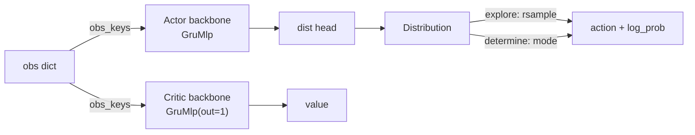

# Models & Networks

<span class="dx-eyebrow">Thunder</span>

In [Agents & Algorithms](agents.md) we saw that `Actor` / `Critic` each carry a **backbone network** and a **distribution head**. This page zooms in to answer three questions:

1. **What models exist today?** — the full catalogue, from low-level blocks (`modules/`) to higher-level models (`models/`).
2. **How are they constructed?** — Thunder's uniform "self-building spec" pattern (`ModelSpec.factory`).
3. **How do actor / critic use them in RL?** — backbone + head wiring, forward, sampling, recurrent carry.

!!! abstract "Two layers"
    - **`thunder.nn.torch.modules`** — **building blocks**: MLP / CNN / RNN / SSM (Mamba) / Attention / normalization / activation. Every block usable as a backbone ships a **`*Spec`**.
    - **`thunder.nn.torch.models`** — **higher-level models**: belief/perception encoders, RBF, world-model (partly scaffolding). Mostly constructed via "bring-your-own `conv_head`, direct `__init__`".
    - **`thunder.rl.torch.models`** — the RL-side **`Actor` / `Critic`**: they assemble the backbones above + a distribution head into policy / value networks.

---

## 1. Construction pattern: self-building specs (`ModelSpec`)

Thunder uses no registry and no factory strings. Every block usable as a backbone has a **`*Spec` dataclass** that **knows how to build itself**:

```python
# thunder/nn/torch/modules/base.py
@dataclass
class ModelSpec(ABC):
    class_type: ClassVar[Type[nn.Module]]   # the concrete nn.Module this spec builds
    out_shape: int = 256                     # feature dim emitted (consumed downstream)

    @abstractmethod
    def factory(self, *in_shapes, **ctx) -> nn.Module: ...
```

- **`out_shape`** — the feature dimension this block emits. Downstream (the distribution head, or the next spec) aligns to it.
- **`class_type`** — a `ClassVar` naming the `nn.Module` to instantiate (not a dataclass field).
- **`factory(*in_shapes, **ctx)`** — the real construction entry point. `in_shapes` is the **feature shape of each input stream**: an `int` for vectors, a `(C, H, W)` tuple for images, one per stream.

**Lifecycle**: fill a `*Spec` with hyperparameters → call `spec.factory(in_shape0, in_shape1, …)` → get the live `nn.Module`. Composite specs **recurse**: they pass the previous block's `out_shape` forward as the next block's input dim.

### The uniform carry contract

Every spec-built block obeys the same forward signature, so they compose seamlessly:

```python
output, carry = block(*inputs, carry)     # carry=None means "fresh state"
```

Stateless blocks (MLP, CNN) pass `carry` through unchanged; recurrent blocks (RNN, Mamba) actually read/write it. **There is no `init_carry()` — `None` is the initial state**, expanded into one-per-block as needed.

### Two composite specs

| Spec | Role | Key fields |
| --- | --- | --- |
| `SequentialSpec` | **Chain** blocks; `out_shape` auto-taken from the last | `blocks: Tuple[ModelSpec, ...]` |
| `MultiModelSpec` | **Multi-stream fuse**: one encoder per stream → `concat` on last dim → a trunk | `encoders: Tuple[ModelSpec, ...]`, `trunk: ModelSpec` |

```python
from thunder.nn.torch import SequentialSpec, LinearBlockSpec, MambaSpec

# Project to 256 first, then Mamba (Mamba is dim-preserving, so align dims up front)
backbone = SequentialSpec(blocks=(
    LinearBlockSpec(out_shape=256),
    MambaSpec(out_shape=256),
))
```

!!! note "No registry"
    The spec → class mapping is only the `class_type` `ClassVar` plus each spec's hand-written `factory` — no decorators / `__init_subclass__` / string lookup. The only string table is the activation-name map `ACTIVATION_CLS_NAME` (`"mish"→nn.Mish`, `"silu"→nn.SiLU`…), used inside blocks via `getattr(nn, ...)`.

---

## 2. Building-block catalogue (`thunder.nn.torch.modules`)

Blocks with a **Spec** can be dropped straight in as an `Actor` / `Critic` backbone; those without are bare `nn.Module`s for higher-level models or manual assembly.

### MLP / linear

| Class | Spec | Notes | Key params (defaults) |
| --- | --- | --- | --- |
| `LinearBlock` | ✅ `LinearBlockSpec` | Standard multi-layer MLP, orthogonal init (gain=2.0) | `hidden_features=(256,128)`, `activation="mish"`, `activate_output=False` |
| `SirenBlock` | ✖️ | Periodic-activation (SIREN) MLP with `omega` first-layer special-casing | `hidden_features`, `omega=30.0` |

### Convolution / vision

| Class | Spec | Notes |
| --- | --- | --- |
| `Conv2dBlock` | ✅ `CnnSpec` | 2D conv stack + global-avg-pool + `Linear` projection to `out_shape` (`CnnSpec` defaults `channels=(32,64)`, `kernel_sizes=(3,3)`); forward folds time into batch: `[B,L,C,H,W]→[B,L,out_shape]` |
| `Conv1dBlock` | ✖️ | 1D conv stack (time series) |
| `ResBasicBlock` / `ResBottleneckBlock` | ✖️ | Residual blocks |

### Recurrent (RNN)

| Class | Spec | carry |
| --- | --- | --- |
| `GruMlp` | ✅ `GruMlpSpec` | GRU + MLP; carry is a single tensor `h` |
| `LstmMlp` | ✅ `LstmMlpSpec` | LSTM + MLP; carry is `(h, c)` |
| `RecurrentMlp` | ✅ `RecurrentMlpSpec` | Dispatches on `rnn_type∈{"gru","lstm"}` |

All three specs share fields: `rnn_hidden_size=256`, `mlp_shape=()`, `rnn_num_layers=1`, `activation="mish"`. **`GruMlpSpec` is the default actor/critic backbone.**

!!! note "RNN carry layout"
    RNN blocks transpose PyTorch's native `[layers, batch, hidden]` to **batch-first** `[batch, layers, hidden]` at the boundary and back — exactly the layout the Agent threads as `policy_carry` / `critic_carry`. Passing `hx=None` zero-initializes.

### State-space models (Mamba)

| Class | Spec | Notes |
| --- | --- | --- |
| `Mamba2Block` | ✅ `MambaSpec` | Mamba-2 (default); auto-falls back to pure-PyTorch `ssd_minimal` if the official Triton kernel fails |
| `MambaBlock` | ✖️ | Mamba-1 |

`MambaSpec` fields: `d_state=64`, `d_conv=4`, `expand=2`, `headdim=64`, `activation="silu"`, `official_ops=False`. **Dim-preserving**: it requires input dim == `out_shape`, so usually prepend a `LinearBlockSpec` projection via `SequentialSpec` (see above). Both Mamba blocks expose an explicit single-step `step(x_t, state)`.

### Attention / normalization / activation (no Spec, bare modules)

- **Attention** (`modules.attention`): `MultiHeadCrossAttention`, `MultiHeadLinearCrossAttention` (linear attention), `SpatialSoftmax` / `SpatialArgSoftmax` (differentiable keypoints) and their `*Uncertainty` variants, `ChannelAttention` / `SpatialAttention` / `CoordinateAttention`.
- **Transformer** (`modules.transformer`): `PositionalEncoding` (sinusoidal; currently the only class — no Transformer-block spec).
- **Normalization** (`modules.normalization`): `Normalization` (fixed mean/var), `RunningNorm1d` (Welford online stats), `DictRunningNorm1d` (per-key normalization).
- **Activation** (`modules.activation`): `Sin` / `Cos` / `Squash` (`SoftThreshold` is an unimplemented stub).

---

## 3. Higher-level models (`thunder.nn.torch.models`)

This layer **does not use the spec pattern**; it is constructed via direct `__init__`. The belief encoders additionally follow a "bring-your-own `conv_head`" convention (build a `Conv2dBlock` externally and pass it in).

### belief: perception / belief encoders (`models.belief`, implemented)

Common recipe: split the input into a **flat vector** part and an **image tail**, run the tail through the supplied `conv_head`, fuse with the flat part, run an `nn.LSTM`, then project with a `LinearBlock`. `forward(input, hx=None) -> (output, (h_n, c_n))`; the caller threads the recurrent state. The five differ in how conv features are fused:

| Class | Fusion |
| --- | --- |
| `Perception` | Plain concat + conv residual projection (simplest) |
| `LinearMhaPerception` | Multi-head **linear** cross-attention + 2D positional embedding |
| `BeliefPerception` | Slices a gate from the hidden state; sigmoid-gates the conv residual (default `softsign`) |
| `MhaBelief` | Linear cross-attention **+** hidden-state gating (the previous two combined) |
| `SpatialBelief` | Extracts differentiable **spatial keypoints** + uncertainty (`SpatialArgSoftmaxUncertainty`) |

```python
from thunder.nn.torch.modules import Conv2dBlock
from thunder.nn.torch.models import Perception

conv_head = Conv2dBlock(in_shape=(3, 64, 64), channels=(32, 64), gap=True)
enc = Perception(in_features=128, out_features=256, rnn_hidden_size=256, conv_head=conv_head)
```

### RBF (`models.rbf`)

- **`GaussianRbf` (implemented)** — Gaussian-kernel radial basis function network, a universal function approximator. `__init__(in_features, out_features, kernel_num, normalized=False, norm_order=2)`, `forward(x) -> y`, no recurrent state.
- `Rbf` — generic RBF placeholder (unimplemented).

### world-model / dynamic (mostly scaffolding)

!!! warning "The following are scaffolding, not yet implemented"
    `RepresentModel` / `TransitionModel` / `EnsembleTransitionModel` in `models.world_model` currently have **empty bodies** (`...`) — they only declare the **intended interface signatures** and cannot be used as-is; reserved for future model-based algorithms (Dreamer / TD-MPC style). `TransitionModel.state0(batch_size)` is the intended initial-carry constructor; `EnsembleTransitionModel.forward` plans to return a `Normal` for disagreement-based exploration.

`models.dynamic` provides a Hydra-style config instantiator `recursive_instantiate(cfg)`: given a dict with `"_target_"` (a dotted path), it recursively instantiates nested structures and calls `cls(**kwargs)`.

---

## 4. How actor and critic use these models

The RL side, in `thunder.rl.torch.models`, assembles the backbones above into policy / value networks. **Core structure: `Actor` = backbone + distribution head + `obs_keys`; `Critic` = backbone + `obs_keys` (no head — the backbone emits the scalar value directly).**

### Declaration: ActorSpec / CriticSpec

```python
@dataclass
class ActorSpec:
    obs_keys: Tuple[str, ...] = ("policy",)
    backbone: ModelSpec = field(default_factory=lambda: GruMlpSpec(out_shape=256, mlp_shape=()))
    head: DistributionHeadSpec = field(default_factory=ConsistentNormalHeadSpec)

@dataclass
class CriticSpec:
    obs_keys: Tuple[str, ...] = ("policy",)
    backbone: ModelSpec = field(default_factory=lambda: GruMlpSpec(out_shape=1, mlp_shape=(256, 128)))
```

Note the critic backbone's `out_shape=1` — **the value is the backbone MLP's final output; there is no separate value head**. Each spec's `factory` picks shapes from `obs_shapes` by `obs_keys`, builds the backbone, and the actor hands the backbone's `out_shape` and `action_dim` to the distribution head:

```python
# ActorSpec.factory
in_shapes = [obs_shapes[k] for k in self.obs_keys]
backbone  = self.backbone.factory(*in_shapes, **ctx)
head      = self.head.factory(self.backbone.out_shape, action_dim, **ctx)
return Actor(backbone, head, self.obs_keys)
```

How `obs_keys` aligns environment observation groups to backbone inputs is covered in [Agents & Algorithms · obs_keys](agents.md#obs_keys); shapes are inferred from `env.single_observation_space`, so you never hand-fill dimensions.

### Forward: distribution vs value

```python
class Actor(ThunderModule):
    def forward(self, obs, carry=None):
        feature, carry = self.backbone(*(obs[k] for k in self.obs_keys), carry)
        return self.dist(feature), carry          # -> (Distribution, carry)

    def explore(self, obs, carry=None):           # collection: reparameterized sample
        dist, carry = self.forward(obs, carry)
        action, log_prob = dist.rsample()
        return ActorStep(action, log_prob, dist, carry)

    def determine(self, obs, carry=None):         # evaluation: take the mode
        dist, carry = self.forward(obs, carry)
        action = dist.mode(); log_prob = dist.log_prob(action)
        return ActorStep(action, log_prob, dist, carry)
```

`Critic.forward` is simpler: `return self.backbone(*(obs[k] for k in self.obs_keys), carry)`, i.e. `(value, carry)`.

### Distribution heads: where the action distribution comes from

`Actor` doesn't hard-code the distribution type — it's decided by the plugged-in `DistributionHead`:

| Distribution head spec | Distribution | Trait |
| --- | --- | --- |
| `ConsistentNormalHeadSpec` (default) | `Normal` | std is a **state-independent learnable global parameter** |
| `NormalHeadSpec` | `Normal` | std produced by the network (state-dependent) |
| `TransformedDistHeadSpec` | `TransformedDistribution` | tanh-squashed to bounded |
| `BetaHeadSpec` | `ScaledBeta` | **analytically bounded** actions, no post-hoc clamp (see [PPO · ScaledBeta](ppo.md)) |

### Runtime: act / infer and carry

`PpoAgent` binds the models as `self.actor` / `self.critic` (via `ModelPack`) and threads `self.policy_carry` / `self.critic_carry` across steps:

```python
def act(self, obs, explore=True):
    obs_seq = {k: v.unsqueeze(1) for k, v in obs.items()}     # add a length-1 time axis
    step = self.actor.explore(obs_seq, self.policy_carry) if explore \
           else self.actor.determine(obs_seq, self.policy_carry)
    self.policy_carry = step.carry
    value, self.critic_carry = self.critic(obs_seq, self.critic_carry)
    # …write transition: actions / log_prob / values (time axis squeezed out)…
```

- The backbone is a sequence model expecting `[N, L, F]`; the env gives `[N, F]` per step, so `act` / `infer` `unsqueeze(1)` a time axis and `squeeze` it back (see [Agent · the act/infer time axis](agents.md)).
- `infer` runs the actor only — no value, no buffer write (evaluation / deployment).
- `reset(dones)` zeroes the carry of finished environments at episode boundaries.



### How PPO consumes actor / critic outputs

The loss ops (`thunder.rl.torch.operations`) **re-run** the networks from the trajectory-start carry:

- `PpoSurrogateLoss`: re-runs `actor.forward` from `cache.initial.policy_carry` to get a fresh `dist`, recomputes `log_prob` of the **stored** actions, forms the clipped ratio against the old rollout `log_prob`; it also exports `kl` for the adaptive-LR scheduler.
- `CriticLoss`: re-runs `critic` from `cache.initial.critic_carry`, regresses to `returns` with value-clipping.

Why only the trajectory's first carry is needed, and how `SplitTraj` slices it, is covered in [PPO · Recurrent PPO](ppo.md).

---

## 5. In practice: swapping a model

Swapping a network = swapping a spec; the actor/critic wiring and downstream losses don't change.

```python
from thunder.nn.torch import (
    LstmMlpSpec, MambaSpec, SequentialSpec, LinearBlockSpec,
    CnnSpec, MultiModelSpec, BetaHeadSpec,
)
from thunder.rl.torch.models import ActorSpec, CriticSpec

# 1) Swap the backbone: GRU → LSTM
actor = ActorSpec(backbone=LstmMlpSpec(out_shape=256, rnn_hidden_size=256))

# 2) Swap the backbone: Mamba (dim-preserving, prepend a projection)
actor = ActorSpec(backbone=SequentialSpec(blocks=(
    LinearBlockSpec(out_shape=256), MambaSpec(out_shape=256),
)))

# 3) Multi-modal: state → MLP, pixels → CNN, concat then a GRU trunk
actor = ActorSpec(
    obs_keys=("state", "pixels"),
    backbone=MultiModelSpec(
        encoders=(LinearBlockSpec(out_shape=128), CnnSpec(out_shape=128)),
        trunk=GruMlpSpec(out_shape=256),
    ),
)

# 4) Bounded actions: swap the distribution head
actor = ActorSpec(head=BetaHeadSpec(low=-1.0, high=1.0, concentration_offset=1.0))

# 5) Asymmetric actor-critic: critic also sees a privileged state stream
critic = CriticSpec(obs_keys=("policy", "state"),
                    backbone=MultiModelSpec(
                        encoders=(GruMlpSpec(out_shape=128), LinearBlockSpec(out_shape=128)),
                        trunk=LinearBlockSpec(out_shape=1, hidden_features=(128,))))
```

!!! tip "To change a task, change it task-side"
    Don't edit the `ActorSpec` / `CriticSpec` defaults to tune one task. Task-specific network structure is registered **environment-side** in `thunder_cfg` (see [PPO · where hyperparameters live](ppo.md)); `--agent.actor.xxx` on the CLI can override temporarily.

The full API signatures (every spec field, every block's constructor parameters) are in the auto-generated [Thunder API reference](../reference/api/thunder.md).
