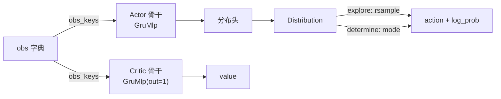

# 模型与网络

<span class="dx-eyebrow">Thunder</span>

[Agent 与算法](agents.md) 里我们看到 `Actor` / `Critic` 各自挂着一个**骨干网络**和一个**分布头**。这一页把镜头拉近，回答三个问题：

1. **现在有哪些模型？** —— 从底层积木（`modules/`）到高层模型（`models/`）的完整目录。
2. **它们怎么构造？** —— Thunder 统一的「Spec 自建」范式（`ModelSpec.factory`）。
3. **RL 里 actor / critic 怎么用这些模型？** —— 骨干 + 头的接线、前向、采样、recurrent carry。

!!! abstract "两层结构"
    - **`thunder.nn.torch.modules`** —— **积木块**：MLP / CNN / RNN / SSM(Mamba) / Attention / 归一化 / 激活。可直接当骨干的块都带一个 **`*Spec`**。
    - **`thunder.nn.torch.models`** —— **高层模型**：belief 感知编码器、RBF、world-model（部分为占位）。多为「自带 `conv_head`、直接 `__init__`」构造。
    - **`thunder.rl.torch.models`** —— RL 侧的 **`Actor` / `Critic`**：把上面的骨干 + 分布头组装成策略 / 价值网络。

---

## 一、构造范式：Spec 自建（`ModelSpec`）

Thunder 不用注册表、不用工厂字符串。每一个可作骨干的网络块都配一个 **`*Spec` 数据类**，它**自己知道怎么把自己造出来**：

```python
# thunder/nn/torch/modules/base.py
@dataclass
class ModelSpec(ABC):
    class_type: ClassVar[Type[nn.Module]]   # 这个 spec 造出的具体 nn.Module
    out_shape: int = 256                     # 输出特征维（交给下游头/下一块）

    @abstractmethod
    def factory(self, *in_shapes, **ctx) -> nn.Module: ...
```

- **`out_shape`** —— 这块网络吐出的特征维度。下游（分布头、或下一块 spec）就按它对齐输入。
- **`class_type`** —— 一个 `ClassVar`，指明要实例化的 `nn.Module` 类（不是数据类字段）。
- **`factory(*in_shapes, **ctx)`** —— 真正的构造入口。`in_shapes` 是**每一路输入的特征形状**：向量输入是 `int`，图像输入是 `(C, H, W)` 元组，一路一个。

**生命周期**：填好超参的 `*Spec` → 调 `spec.factory(in_shape0, in_shape1, …)` → 拿到实例化好的 `nn.Module`。组合型 spec 会**递归**：把上一块的 `out_shape` 当作下一块的输入维往下传。

### 统一的 carry 契约

所有由 spec 造出的块都遵守同一个前向签名，于是它们能无缝串联：

```python
output, carry = block(*inputs, carry)     # carry=None 表示「全新状态」
```

无状态的块（MLP、CNN）会把 `carry` 原样透传；recurrent 块（RNN、Mamba）才真正读写它。**没有 `init_carry()` 这种方法 —— `None` 就是初始状态**，框架会在需要时把它展开成每块一份。

### 两种组合 spec

| Spec | 作用 | 关键字段 |
| --- | --- | --- |
| `SequentialSpec` | **串联**多块，`out_shape` 自动取最后一块 | `blocks: Tuple[ModelSpec, ...]` |
| `MultiModelSpec` | **多路融合**：每路一个 encoder → 沿最后一维 `concat` → 过一个 trunk | `encoders: Tuple[ModelSpec, ...]`、`trunk: ModelSpec` |

```python
from thunder.nn.torch import SequentialSpec, LinearBlockSpec, MambaSpec

# 先投影到 256，再过 Mamba（Mamba 维度保持，必须先投影对齐）
backbone = SequentialSpec(blocks=(
    LinearBlockSpec(out_shape=256),
    MambaSpec(out_shape=256),
))
```

!!! note "没有注册表"
    spec → 类 的映射只靠 `class_type` 这个 `ClassVar` 加每个 spec 手写的 `factory`，没有装饰器 / `__init_subclass__` / 字符串查表。唯一的字符串查表是激活函数名 `ACTIVATION_CLS_NAME`（`"mish"→nn.Mish`、`"silu"→nn.SiLU`…），块内部用它 `getattr(nn, ...)` 取激活类。

---

## 二、积木目录（`thunder.nn.torch.modules`）

带 **Spec** 的块可以直接当 `Actor` / `Critic` 的骨干；没有 Spec 的是裸 `nn.Module`，供高层模型或手动组装使用。

### MLP / 线性

| 类 | Spec | 说明 | 关键参数（默认） |
| --- | --- | --- | --- |
| `LinearBlock` | ✅ `LinearBlockSpec` | 标准多层 MLP，正交初始化（gain=2.0） | `hidden_features=(256,128)`、`activation="mish"`、`activate_output=False` |
| `SirenBlock` | ✖️ | 周期激活（SIREN）MLP，含 `omega` 首层特判 | `hidden_features`、`omega=30.0` |

### 卷积 / 视觉

| 类 | Spec | 说明 |
| --- | --- | --- |
| `Conv2dBlock` | ✅ `CnnSpec` | 2D 卷积栈 + 全局平均池化 + `Linear` 投影到 `out_shape`（`CnnSpec` 默认 `channels=(32,64)`、`kernel_sizes=(3,3)`）；前向会把时间轴折进 batch：`[B,L,C,H,W]→[B,L,out_shape]` |
| `Conv1dBlock` | ✖️ | 1D 卷积栈（时序信号） |
| `ResBasicBlock` / `ResBottleneckBlock` | ✖️ | 残差块 |

### 循环（RNN）

| 类 | Spec | carry |
| --- | --- | --- |
| `GruMlp` | ✅ `GruMlpSpec` | GRU + MLP；carry 为单张量 `h` |
| `LstmMlp` | ✅ `LstmMlpSpec` | LSTM + MLP；carry 为 `(h, c)` |
| `RecurrentMlp` | ✅ `RecurrentMlpSpec` | 按 `rnn_type∈{"gru","lstm"}` 分派 |

三者 Spec 字段一致：`rnn_hidden_size=256`、`mlp_shape=()`、`rnn_num_layers=1`、`activation="mish"`。**`GruMlpSpec` 就是 actor/critic 的默认骨干。**

!!! note "RNN 的 carry 布局"
    RNN 块在边界把 PyTorch 原生的 `[layers, batch, hidden]` 转成 **batch-first** 的 `[batch, layers, hidden]` 再转回 —— 这正是 Agent 跨步维护 `policy_carry` / `critic_carry` 的布局。传 `hx=None` 即零初始化。

### 状态空间模型（Mamba）

| 类 | Spec | 说明 |
| --- | --- | --- |
| `Mamba2Block` | ✅ `MambaSpec` | Mamba-2（默认）；官方 Triton kernel 失败时自动回退到纯 PyTorch `ssd_minimal` |
| `MambaBlock` | ✖️ | Mamba-1 |

`MambaSpec` 字段：`d_state=64`、`d_conv=4`、`expand=2`、`headdim=64`、`activation="silu"`、`official_ops=False`。**维度保持**：要求输入维 == `out_shape`，所以通常用 `SequentialSpec` 在前面接一个 `LinearBlockSpec` 投影（见上文示例）。两个 Mamba 块都提供显式单步 `step(x_t, state)`。

### 注意力 / 归一化 / 激活（均无 Spec，裸模块）

- **Attention**（`modules.attention`）：`MultiHeadCrossAttention`、`MultiHeadLinearCrossAttention`（线性注意力）、`SpatialSoftmax` / `SpatialArgSoftmax`（可微关键点）及其 `*Uncertainty` 变体、`ChannelAttention` / `SpatialAttention` / `CoordinateAttention`。
- **Transformer**（`modules.transformer`）：`PositionalEncoding`（正弦位置编码；目前仅此一项，无 Transformer block 的 Spec）。
- **归一化**（`modules.normalization`）：`Normalization`（固定均值方差）、`RunningNorm1d`（Welford 在线统计）、`DictRunningNorm1d`（按字典 key 各归一化）。
- **激活**（`modules.activation`）：`Sin` / `Cos` / `Squash`（`SoftThreshold` 为未实现占位）。

---

## 三、高层模型（`thunder.nn.torch.models`）

这一层**不用 Spec 范式**，靠直接 `__init__` 构造；belief 编码器还遵循「自带 `conv_head`」约定（外部先建好一个 `Conv2dBlock` 传进去）。

### belief：感知 / 信念编码器（`models.belief`，已实现）

统一套路：把输入拆成**扁平向量**部分和**图像尾**部分，图像尾过传入的 `conv_head`，与扁平部分融合后过 `nn.LSTM`，再用 `LinearBlock` 投影。`forward(input, hx=None) -> (output, (h_n, c_n))`，recurrent 状态由调用方维护。五者差别在「怎么融合卷积特征」：

| 类 | 融合方式 |
| --- | --- |
| `Perception` | 直接 concat + 卷积残差投影（最简） |
| `LinearMhaPerception` | 多头**线性**交叉注意力 + 2D 位置编码 |
| `BeliefPerception` | 隐状态切出门控位，sigmoid 门控卷积残差（默认 `softsign`） |
| `MhaBelief` | 线性交叉注意力 **+** 隐状态门控（前两者结合） |
| `SpatialBelief` | 提取可微**空间关键点**及其不确定度（`SpatialArgSoftmaxUncertainty`）喂入 |

```python
from thunder.nn.torch.modules import Conv2dBlock
from thunder.nn.torch.models import Perception

conv_head = Conv2dBlock(in_shape=(3, 64, 64), channels=(32, 64), gap=True)
enc = Perception(in_features=128, out_features=256, rnn_hidden_size=256, conv_head=conv_head)
```

### RBF（`models.rbf`）

- **`GaussianRbf`（已实现）** —— 高斯核径向基网络，通用函数逼近器。`__init__(in_features, out_features, kernel_num, normalized=False, norm_order=2)`，`forward(x) -> y`，无 recurrent 状态。
- `Rbf` —— 通用 RBF 占位（未实现）。

### world-model / dynamic（多为占位）

!!! warning "以下为脚手架，尚未实现"
    `models.world_model` 里的 `RepresentModel` / `TransitionModel` / `EnsembleTransitionModel` 目前**函数体为空**（`...`），只定义了**意图中的接口签名**，不能直接用——给将来的 model-based 算法（如 Dreamer / TD-MPC 风格）预留。其中 `TransitionModel.state0(batch_size)` 是约定的初始 carry 构造器，`EnsembleTransitionModel.forward` 计划返回 `Normal` 以支持基于分歧的探索。

`models.dynamic` 提供一个 Hydra 风格的配置实例化助手 `recursive_instantiate(cfg)`：给定含 `"_target_"`（点路径）的 dict，递归实例化嵌套结构并 `cls(**kwargs)`。

---

## 四、Actor 与 Critic 如何使用这些模型

RL 侧在 `thunder.rl.torch.models` 把上面的骨干装成策略 / 价值网络。**核心结构：`Actor` = 骨干 + 分布头 + `obs_keys`；`Critic` = 骨干 + `obs_keys`（无头，骨干直接吐标量价值）。**

### 声明：ActorSpec / CriticSpec

```python
@dataclass
class ActorSpec:
    obs_keys: Tuple[str, ...] = ("policy",)
    backbone: ModelSpec = field(default_factory=lambda: GruMlpSpec(out_shape=256, mlp_shape=()))
    head: DistributionHeadSpec = field(default_factory=ConsistentNormalHeadSpec)

@dataclass
class CriticSpec:
    obs_keys: Tuple[str, ...] = ("policy",)
    backbone: ModelSpec = field(default_factory=lambda: GruMlpSpec(out_shape=1, mlp_shape=(256, 128)))
```

注意 critic 的骨干 `out_shape=1` —— **价值就是骨干 MLP 的最后一层输出，没有单独的价值头**。两个 spec 的 `factory` 按 `obs_keys` 去 `obs_shapes` 里挑形状、造骨干，actor 再把骨干的 `out_shape` 和 `action_dim` 交给分布头：

```python
# ActorSpec.factory
in_shapes = [obs_shapes[k] for k in self.obs_keys]
backbone  = self.backbone.factory(*in_shapes, **ctx)
head      = self.head.factory(self.backbone.out_shape, action_dim, **ctx)
return Actor(backbone, head, self.obs_keys)
```

`obs_keys` 如何把环境观测组对齐到骨干输入，详见 [Agent 与算法 · obs_keys](agents.md#obs_keys)；形状从 `env.single_observation_space` 自动推出，无需手填维度。

### 前向：分布 vs 价值

```python
class Actor(ThunderModule):
    def forward(self, obs, carry=None):
        feature, carry = self.backbone(*(obs[k] for k in self.obs_keys), carry)
        return self.dist(feature), carry          # -> (Distribution, carry)

    def explore(self, obs, carry=None):           # 采集：可重参数化采样
        dist, carry = self.forward(obs, carry)
        action, log_prob = dist.rsample()
        return ActorStep(action, log_prob, dist, carry)

    def determine(self, obs, carry=None):         # 评估：取众数
        dist, carry = self.forward(obs, carry)
        action = dist.mode(); log_prob = dist.log_prob(action)
        return ActorStep(action, log_prob, dist, carry)
```

`Critic.forward` 更简单：`return self.backbone(*(obs[k] for k in self.obs_keys), carry)`，即 `(value, carry)`。

### 分布头：动作分布从哪来

`Actor` 不写死分布类型，由插入的 `DistributionHead` 决定：

| 分布头 Spec | 产出分布 | 特点 |
| --- | --- | --- |
| `ConsistentNormalHeadSpec`（默认） | `Normal` | std 是一个**与状态无关的可学习全局参数** |
| `NormalHeadSpec` | `Normal` | std 由网络输出（与状态相关） |
| `TransformedDistHeadSpec` | `TransformedDistribution` | tanh 压扁到有界 |
| `BetaHeadSpec` | `ScaledBeta` | **解析有界**动作，无需事后 clamp（见 [PPO 实战 · ScaledBeta](ppo.md)） |

### 运行时：act / infer 与 carry

`PpoAgent` 把模型挂成 `self.actor` / `self.critic`（经 `ModelPack`），并跨步维护 `self.policy_carry` / `self.critic_carry`：

```python
def act(self, obs, explore=True):
    obs_seq = {k: v.unsqueeze(1) for k, v in obs.items()}     # 补长度=1 的时间轴
    step = self.actor.explore(obs_seq, self.policy_carry) if explore \
           else self.actor.determine(obs_seq, self.policy_carry)
    self.policy_carry = step.carry
    value, self.critic_carry = self.critic(obs_seq, self.critic_carry)
    # …写入 transition：actions / log_prob / values（都 squeeze 掉时间轴）…
```

- 骨干是序列模型，吃 `[N, L, F]`；环境每步只给 `[N, F]`，所以 `act` / `infer` 用 `unsqueeze(1)` 补时间轴、`squeeze` 取回（参见 [Agent · act 与 infer 的时间轴](agents.md)）。
- `infer` 只跑 actor、不算价值、不写 buffer（评估 / 部署用）。
- `reset(dones)` 在 episode 边界把已结束环境的 carry 清零。



### PPO 如何消费 actor / critic 输出

损失算子（`thunder.rl.torch.operations`）从轨迹起点的 carry **重放**网络：

- `PpoSurrogateLoss`：用 `cache.initial.policy_carry` 重跑 `actor.forward` 得到新 `dist`，对**存下来的动作**重算 `log_prob`，与采集时的旧 `log_prob` 做裁剪式比值；并导出 `kl` 供自适应学习率调度器。
- `CriticLoss`：用 `cache.initial.critic_carry` 重跑 `critic`，对 `returns` 回归，带 value-clipping。

为什么只需要轨迹首帧的 carry、`SplitTraj` 怎么切，详见 [PPO 实战 · Recurrent PPO](ppo.md)。

---

## 五、实战：换一个模型

换网络 = 换 spec，actor/critic 的接线和下游损失都不动。

```python
from thunder.nn.torch import (
    LstmMlpSpec, MambaSpec, SequentialSpec, LinearBlockSpec,
    CnnSpec, MultiModelSpec, BetaHeadSpec,
)
from thunder.rl.torch.models import ActorSpec, CriticSpec

# 1) 换骨干：GRU → LSTM
actor = ActorSpec(backbone=LstmMlpSpec(out_shape=256, rnn_hidden_size=256))

# 2) 换骨干：Mamba（维度保持，前面接投影）
actor = ActorSpec(backbone=SequentialSpec(blocks=(
    LinearBlockSpec(out_shape=256), MambaSpec(out_shape=256),
)))

# 3) 多模态：state 走 MLP、pixels 走 CNN，concat 后过 GRU trunk
actor = ActorSpec(
    obs_keys=("state", "pixels"),
    backbone=MultiModelSpec(
        encoders=(LinearBlockSpec(out_shape=128), CnnSpec(out_shape=128)),
        trunk=GruMlpSpec(out_shape=256),
    ),
)

# 4) 有界动作：换分布头
actor = ActorSpec(head=BetaHeadSpec(low=-1.0, high=1.0, concentration_offset=1.0))

# 5) 非对称 actor-critic：critic 多看一路特权 state
critic = CriticSpec(obs_keys=("policy", "state"),
                    backbone=MultiModelSpec(
                        encoders=(GruMlpSpec(out_shape=128), LinearBlockSpec(out_shape=128)),
                        trunk=LinearBlockSpec(out_shape=1, hidden_features=(128,))))
```

!!! tip "改任务，去任务侧改"
    别直接编辑 `ActorSpec` / `CriticSpec` 的默认值来调某个任务。任务专属的网络结构注册在**环境侧**的 `thunder_cfg`（见 [PPO 实战 · 超参在哪配](ppo.md)）；命令行 `--agent.actor.xxx` 可临时覆盖。

完整的 API 签名（每个 Spec 的全部字段、每个块的构造参数）见自动生成的 [Thunder API 参考](../reference/api/thunder.md)。
