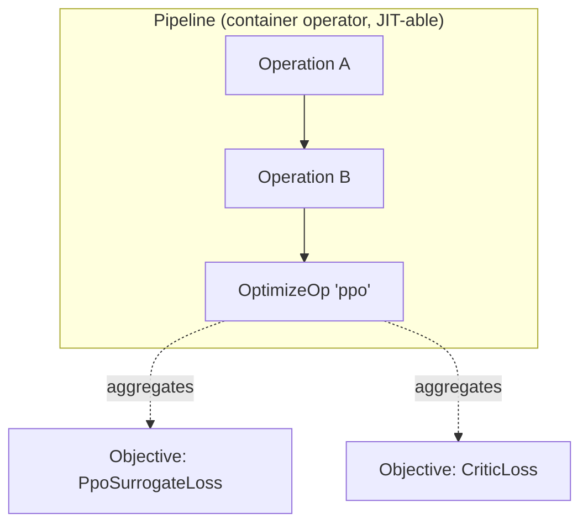
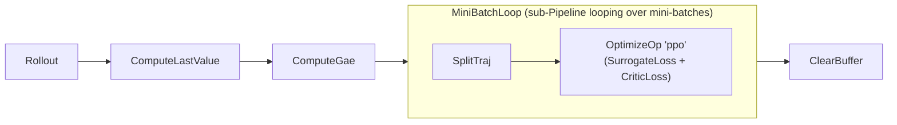

# Operations & Pipeline

<span class="dx-eyebrow">Thunder</span>

`Operation` is Thunder's atom. An algorithm is a chain of Operations that read and write a blackboard `ExecutionContext` in turn. This page makes three things concrete: what the Operation interface looks like, how it declares "what I need and what I provide," and how the three special operators let you assemble algorithms "like drawing a block diagram."

## Operation: the single contract

Every operator subclasses `Operation` and implements just one `forward`:

```python
class Operation(ABC):
    requires: ClassVar[frozenset[Ref]] = frozenset()
    provides: ClassVar[frozenset[Ref]] = frozenset()

    @abstractmethod
    def forward(self, ctx: ExecutionContext) -> Tuple[ExecutionContext, Dict[str, Any]]:
        ...
```

The convention is minimal: **take a ctx, return `(new ctx, metrics dict)`.** The metrics dict holds the scalars/matrices this step wants to record (loss, kl, entropy…); they are automatically prefixed with the operator name and merged into the logs.

A real example — the GAE operator reads rewards/values from the blackboard and writes advantages/returns back:

```python
class ComputeGae(Operation):
    requires = ("batch.rewards", "batch.values", "batch.next_values",
                "batch.terminated", "batch.timeouts")
    provides = ("batch.advantages", "batch.returns")

    def forward(self, ctx):
        batch = ctx.batch
        # ... backward GAE recursion ...
        ctx.batch = batch.replace(advantages=advantages, returns=returns)
        return ctx, {}
```

### requires / provides: a checkable data contract

`requires` and `provides` use a set of **`Ref`s** (references to a path inside the ctx, e.g. `"batch.rewards"`, `"cache.initial.policy_carry"`) to declare which fields this operator reads and produces. They are not comments — they are a contract that gets validated:

- When operators are chained into a `Pipeline`, `PipelineValidator` runs a dataflow analysis: starting from the initially available Refs, it checks for each operator that the fields it `requires` were already `provides`d upstream, then adds its `provides` to the available set.
- A missing link fails immediately, instead of crashing at runtime on a `None`. If a runtime error does occur, `Operation.__call__` wraps the operator name, declared requires/provides, and a batch/cache snapshot into a `PipelineRuntimeError` for quick diagnosis.

!!! tip "Ref normalizes paths"
    `Ref("batch.rewards")` and `Ref('batch["rewards"]')` point to the same place — first-level fields of `Batch`/`AttrData` support both attribute and string-key access, and `Ref` canonicalizes the two internally, so contract validation never reports a false missing link over notation differences.

## The three special operators

The vast majority of algorithms use three kinds of special Operation. They are the real key to "writing algorithms like building blocks."



### 1 · Objective — compute losses

`Objective` is a "read-only" special operator dedicated to computing loss. It wears two faces:

- **Placed directly in a Pipeline**, it acts like a logger: it calls `compute(ctx)` to produce a loss and metrics, recording them without updating the network (its `forward` discards the loss).
- **Aggregated by an `OptimizeOp`**, the `OptimizeOp` calls its `evaluate(ctx)` to obtain the weighted loss as a gradient signal.

You only implement `compute`:

```python
class CriticLoss(Objective):
    requires = ("batch.mask", "batch.obs", "cache.initial.critic_carry",
                "batch.returns", "batch.values")

    def compute(self, ctx) -> tuple[Any, dict]:
        # return (loss, metrics dict)
        return loss, {"value_loss": Scalar(...)}
```

`evaluate` automatically multiplies the loss by `self.weight` and `curriculum(ctx)` (default 1.0, overridable for curriculum learning) and adds `loss` / `weighted_loss` to the metrics. An `Objective` also has an `exports` dict, used to pass a quantity computed inside one operator (e.g. PPO's KL) to other parts of the framework (e.g. an adaptive learning-rate scheduler).

### 2 · OptimizeOp — backward update

`OptimizeOp` takes a set of `Objective`s and runs one gradient-descent step on a named optimizer group:

```python
OptimizeOp(
    "ppo",                                    # name of the optimizer group
    (PpoSurrogateLoss(...), CriticLoss(...)), # objectives; their losses sum
    max_grad_norm=1.0,                        # gradient clipping
)
```

It unions all the objectives' `requires` as its own `requires`, with empty `provides` (it only updates parameters, writing no new field to the blackboard). The actual backward pass, clipping, and `optimizer.step()` are delegated to the backend: `ctx.executor.optimize(ctx, opt, objectives, max_grad_norm)`.

!!! note "Why separate loss from optimization"
    `Objective` only describes "what the objective is"; `OptimizeOp` only describes "which optimizer group, updated how." So the same loss can be reused across optimizer groups, and several losses can be summed inside one `OptimizeOp` — which is exactly where "swap the loss by editing an Objective, swap the optimization strategy by editing an OptimizeOp" comes from.

### 3 · Pipeline — chain operators (and JIT them)

`Pipeline` is itself an `Operation`: it holds a chain of operators, runs them in order, and threads the ctx through. Because it is also an Operation, **a Pipeline can nest Pipelines.**

```python
pipeline = Pipeline(
    [op_a, op_b, OptimizeOp("ppo", [loss_a, loss_b])],
    jit=True,   # compile the whole pipeline via Executor.jit (torch.compile under torch)
)
```

At construction `Pipeline.setup()` will: (1) run `analyze_contract` dataflow analysis over the inner operators and derive the pipeline's overall `requires`/`provides`; (2) `validate` that there is no missing link; (3) `_compile_forward`, deciding whether to compile based on `jit`. Pipeline also offers `append` / `insert` / `remove` / `__setitem__`, and **every edit re-runs `setup` automatically** (re-validate + re-compile). That is why the training script can append a `SaveModels` to the end of the pipeline after the fact:

```python
agent.pipeline.append(SaveModels(spec.save_interval, workspace))
```

## Compose / replace like a block diagram

Put the three together and "changing the algorithm" degrades into "editing a Python list":



- Want **Recurrent PPO**? Insert a `SplitTraj` after sampling (DexLab's PPO already does) to cut the mini-batch into trajectories before the loss.
- Want a **different advantage estimator**? Swap `ComputeGae` for another operator; as long as it `provides` `batch.advantages` / `batch.returns`, the downstream loss is untouched.
- Want an **auxiliary loss**? Drop another `Objective` (such as the representation regularizer `SIGRegObj`) into the `OptimizeOp`'s objective tuple.

As long as adjacent operators' `provides`/`requires` line up, the diagram holds; if they don't, `PipelineValidator` stops you at assembly time.

---

Operators and pipelines are the skeleton. The next page shows how an `Agent` packs models, an environment-interaction strategy, and this pipeline into an `Algorithm`: [Agents & algorithms →](agents.en.md)
