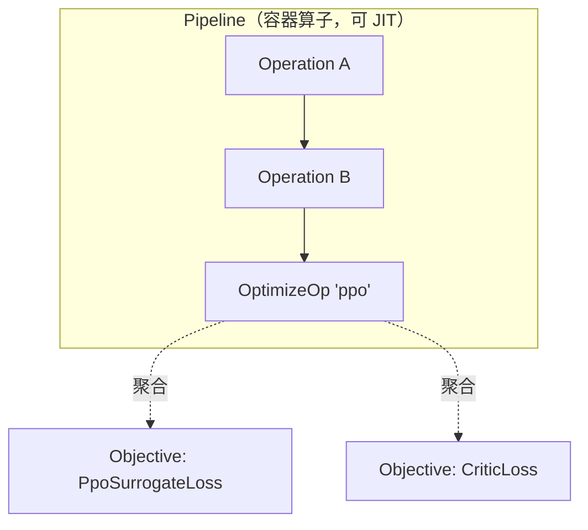
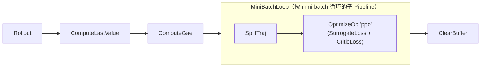

# Operation 与 Pipeline

<span class="dx-eyebrow">Thunder</span>

`Operation` 是 Thunder 的原子。一个算法就是一串 Operation，围绕黑板 `ExecutionContext` 依次读写。这一页讲清楚：Operation 的接口长什么样、它怎么声明"我要什么、我给什么"，以及三种特殊算子如何让你"像画框图一样"拼算法。

## Operation：唯一的契约

每个算子继承 `Operation`，只需实现一个 `forward`：

```python
class Operation(ABC):
    requires: ClassVar[frozenset[Ref]] = frozenset()
    provides: ClassVar[frozenset[Ref]] = frozenset()

    @abstractmethod
    def forward(self, ctx: ExecutionContext) -> Tuple[ExecutionContext, Dict[str, Any]]:
        ...
```

约定极简：**输入一个 ctx，返回 `(新的 ctx, 指标字典)`。** 指标字典里是这一步想记录的标量/矩阵（loss、kl、entropy……），会被自动加上算子名前缀后汇总进日志。

真实例子 —— GAE 算子从黑板取 rewards/values，算出 advantages/returns 写回：

```python
class ComputeGae(Operation):
    requires = ("batch.rewards", "batch.values", "batch.next_values",
                "batch.terminated", "batch.timeouts")
    provides = ("batch.advantages", "batch.returns")

    def forward(self, ctx):
        batch = ctx.batch
        # ... 反向递推 GAE ...
        ctx.batch = batch.replace(advantages=advantages, returns=returns)
        return ctx, {}
```

### requires / provides：可校验的数据契约

`requires` 和 `provides` 用一组 **`Ref`**（对 ctx 内某个路径的引用，如 `"batch.rewards"`、`"cache.initial.policy_carry"`）声明这个算子读哪些字段、产出哪些字段。它们不是注释，而是会被校验的契约：

- 把算子串成 `Pipeline` 时，`PipelineValidator` 会做一次"数据流分析"：从初始可用的 Ref 出发，逐个算子检查它 `requires` 的字段是否已被上游 `provides`，再把它的 `provides` 加入可用集合。
- 缺环立刻报错，而不是等到运行时拿到一个 `None` 才崩。运行期真出错时，`Operation.__call__` 还会把算子名、声明的 requires/provides、batch/cache 快照一起包进 `PipelineRuntimeError`，便于定位。

!!! tip "Ref 会规范化路径"
    `Ref("batch.rewards")` 和 `Ref('batch["rewards"]')` 指向同一处 —— `Batch`/`AttrData` 的一级字段既支持属性访问也支持字符串键，`Ref` 在内部把两者归一，所以契约校验不会因写法不同而误报缺环。

## 三种特殊算子

绝大多数算法都用得上三类特殊 Operation。它们才是"像搭积木一样写算法"的关键。



### 1 · Objective —— 算损失

`Objective` 是一种"只读"的特殊算子，专门计算 loss。它有两副面孔：

- **直接放进 Pipeline 时**，它像个 logger：调用 `compute(ctx)` 算出 loss 和指标，只记录、不更新网络（它的 `forward` 丢弃 loss）。
- **被 `OptimizeOp` 聚合时**，`OptimizeOp` 调它的 `evaluate(ctx)` 拿到加权后的 loss 作为梯度信号。

你只需实现 `compute`：

```python
class CriticLoss(Objective):
    requires = ("batch.mask", "batch.obs", "cache.initial.critic_carry",
                "batch.returns", "batch.values")

    def compute(self, ctx) -> tuple[Any, dict]:
        # 返回 (loss, 指标字典)
        return loss, {"value_loss": Scalar(...)}
```

`evaluate` 会自动给 loss 乘上 `self.weight` 和 `curriculum(ctx)`（默认 1.0，可重载做课程学习），并把 `loss` / `weighted_loss` 加进指标。`Objective` 还有一个 `exports` 字典，用于把某个算子内部算出的量（如 PPO 的 KL）传给框架其它部分（如自适应学习率调度器）。

### 2 · OptimizeOp —— 反向更新

`OptimizeOp` 接收一组 `Objective`，对某个优化器组做一次梯度下降：

```python
OptimizeOp(
    "ppo",                                   # 优化器组的名字
    (PpoSurrogateLoss(...), CriticLoss(...)),# 一组 objective，loss 相加
    max_grad_norm=1.0,                       # 梯度裁剪
)
```

它把所有 objective 的 `requires` 并起来作为自己的 `requires`，`provides` 为空（它只更新参数、不往黑板写新字段）。真正的反向、裁剪、`optimizer.step()` 交给后端：`ctx.executor.optimize(ctx, opt, objectives, max_grad_norm)`。

!!! note "为什么把 loss 和优化分开"
    `Objective` 只描述"目标是什么"，`OptimizeOp` 只描述"对哪个优化器组、怎么更新"。于是同一个 loss 可以被不同优化器组复用，多个 loss 也能塞进一个 `OptimizeOp` 相加 —— 这正是"换损失只改 Objective、换优化策略只改 OptimizeOp"的来源。

### 3 · Pipeline —— 把算子串起来（还能 JIT）

`Pipeline` 本身也是一个 `Operation`：它内部装着一串算子，顺序执行，把 ctx 一路传下去。因为它也是 Operation，所以 **Pipeline 可以嵌套 Pipeline**。

```python
pipeline = Pipeline(
    [op_a, op_b, OptimizeOp("ppo", [loss_a, loss_b])],
    jit=True,   # 用 Executor.jit（torch 下即 torch.compile）编译整条流水线
)
```

构造时 `Pipeline.setup()` 会：①把内部算子做一次 `analyze_contract` 数据流分析、推导出整条流水线的 `requires`/`provides`；②`validate` 校验无缺环；③`_compile_forward` 视 `jit` 决定是否编译。Pipeline 还提供 `append` / `insert` / `remove` / `__setitem__` 等方法，**每次改动都会自动重新 `setup`**（重新校验+重新编译）。这就是为什么训练脚本能在事后往 pipeline 末尾追加一个 `SaveModels`：

```python
agent.pipeline.append(SaveModels(spec.save_interval, workspace))
```

## 像画框图一样组合 / 替换

把这三者放在一起，"改算法"就退化成"改一个 Python 列表"：



- 想做 **Recurrent PPO**？在采样后插一个 `SplitTraj`（DexLab 的 PPO 默认就插了），把 mini-batch 切成轨迹再算 loss。
- 想 **换 advantage 估计**？把 `ComputeGae` 换成别的算子，只要它 `provides` 出 `batch.advantages` / `batch.returns`，下游 loss 不用动。
- 想 **加一个辅助损失**？往 `OptimizeOp` 的 objective 元组里再塞一个 `Objective`（如表征正则 `SIGRegObj`）。

只要相邻算子的 `provides`/`requires` 对得上，框图就成立；对不上，`PipelineValidator` 在组装时就拦下来。

---

算子和流水线是"骨架"。下一页看 `Agent` 如何把模型、与环境交互的策略、以及这条 pipeline 装进一个 `Algorithm`：[Agent 与算法 →](agents.md)
