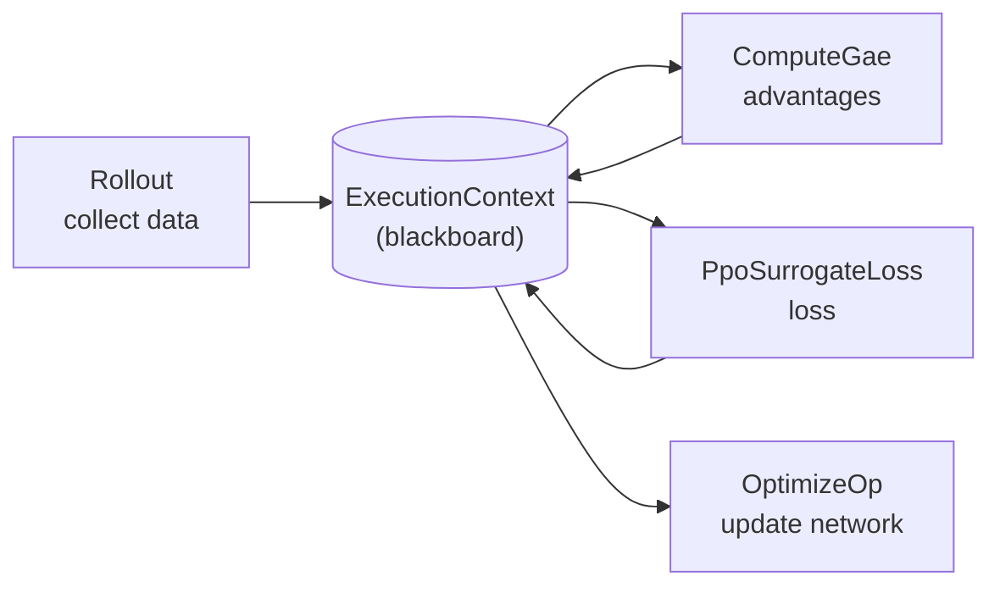

# Philosophy

<span class="dx-eyebrow">Thunder</span>

This page answers one question: **why does Thunder decompose an algorithm into "a pipeline of operators plus a blackboard," instead of writing each algorithm as a monolithic training class?**

## The pain: one change ripples through everything

Consider plain PPO. It is just four steps:

1. interact with the environment, collect data into a buffer;
2. sample a mini-batch from the buffer;
3. compute the loss;
4. update the network.

The **Recurrent PPO** common in robotics only changes step 3 to "first split the mini-batch into trajectories, then compute the loss." Yet in the traditional style, such a "change one step" edit tends to drag the whole training loop with it. Move from PPO to SAC, then to a world model, and the edits only grow.

Thunder's observation: **these algorithms are isomorphic step by step** — each "performs an operation, stores a result, passes it on." So abstract each step into a common base class `Operation`, and an algorithm becomes a chain of Operations. Changing the algorithm means swapping one or two operators.

## The blackboard: ExecutionContext

For "swap one operator, leave the rest" to hold, operators must not call each other directly; they communicate through a shared data structure — the blackboard pattern. In Thunder that blackboard is the `ExecutionContext`.



`ExecutionContext` is a slotted dataclass holding all the state of one training step:

| Field | Meaning |
| --- | --- |
| `step` | current iteration count |
| `models` | `ModelPack`: container of all networks |
| `opt_groups` | optimizer groups (`OptimGroup`) |
| `executor` | the backend executor |
| `manager` | mixed-precision / distributed context manager |
| `batch` | current mini-batch data (`AttrData`/`Batch`) |
| `cache` | side data, e.g. the recurrent carry at trajectory starts |
| `meta` | user-defined metadata |

Each Operation reads the fields it needs from the ctx, computes results, and writes a new ctx back with `ctx.replace(...)` to pass downstream. **The ctx is updated functionally (immutably)** — `replace` returns a new object rather than mutating in place.

!!! info "Why register it as a pytree"
    `ExecutionContext`, `ExecutionContextManager` and `OptimGroup` are all registered as **pytrees** via `register_pytree_node` (one registration each for torch and jax). This lets the backend traverse the whole ctx as a tree whose leaves are tensors and whose structure is containers — the prerequisite for `Executor.jit` (which is `torch.compile` under torch) to compile the entire pipeline, and for the jax backend to `tree_map`/`vmap`. The blackboard is not just a convention for organizing data; it is the structural basis that makes the pipeline compilable.

## Executor and Module: the multi-backend seam

Different tensor frameworks diverge sharply on three things: **model definition, execution flow, and optimization.** Thunder funnels those differences behind two abstractions:

<div class="grid cards" markdown>

-   :material-engine-outline:{ .lg .middle } &nbsp;**Executor**

    ---

    The executor for a backend (torch / jax / warp), giving a uniform API for "initialize the context, JIT-compile, optimize gradients, manage device/precision." Operators call `ctx.executor.optimize(...)` and `Executor.jit(...)` instead of touching `torch` or `jax` directly.

-   :material-cube-outline:{ .lg .middle } &nbsp;**Module**

    ---

    The backend adapter for the neural-network base class. Under jax you must subclass `flax.nnx.Module` and manage state carefully; under torch you subclass `torch.nn.Module` and need not — `Module` smooths the difference away.

</div>

But Thunder **does not force you to subclass its `Module`** to write a network. It offers a container `ModelPack` that wraps the networks you already wrote with native `nn.Module`:

```python
# Pack arbitrary networks; PPO uses the actor / critic (and optional normalizer) keys
models = ModelPack(actor=actor, critic=critic, normalizer=normalizer)
```

`ModelPack` is the uniform entry through which Operations reach networks: an operator writes `ctx.models.actor` / `ctx.models.critic`, while `OptimGroupSpec(targets=("actor", "critic"))` names optimization targets by the same keys.

## torch active, jax / warp planned

The `ExecutionContext` source carries a full set of pytree flatten/unflatten functions for both torch and jax — evidence that "multi-backend" is not a slogan. The backend is selected by the `THUNDER_BACKEND` environment variable (default `torch`).

To be precise about the present, though:

!!! warning "Take torch as the source of truth"
    **Every active RL operator today (Rollout / GAE / SplitTraj / PPO loss, etc.) lives under `thunder.rl.torch`.** The jax path has its seam ready at the core layer (context / module); warp is still planned. All later code in this section is torch-backend; do not treat the jax side as directly usable API.

---

Having grasped "algorithm as pipeline, operators cooperating around a blackboard," the next page covers the real `Operation` interface and how the three special operators compose: [Operations & Pipeline →](operations.en.md)
