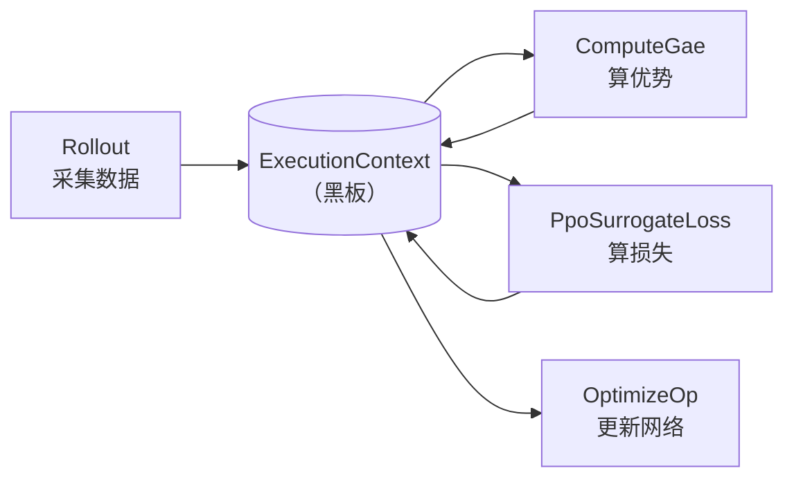

# 设计哲学

<span class="dx-eyebrow">Thunder</span>

这一页回答一个问题：**为什么 Thunder 要把算法拆成"算子流水线 + 一块黑板"，而不是写成一个个完整的训练类？**

## 痛点：算法的"牵一发动全身"

考虑最朴素的 PPO，它无非四步：

1. 与环境交互，把数据收进 buffer；
2. 从 buffer 采样一个 mini-batch；
3. 计算损失；
4. 更新网络。

到了机器人里常用的 **Recurrent PPO**，只需要把第 3 步改成"先把 mini-batch 切成轨迹、再算损失"。可在传统写法里，这种"只改一步"的改动往往要动整个训练循环。当你想从 PPO 换到 SAC、再换到 world model，改动只会越来越大。

Thunder 的观察是：**这些算法在每一步上是同构的** —— 都在"执行某个操作、存下结果、传给后续"。既然如此，就把每一步抽象成一个公共基类 `Operation`，算法 = 一串 Operation。改算法，就只换其中一两个算子。

## 黑板：ExecutionContext

要让"换一个算子、上下游不动"成立，算子之间不能互相直接调用，而要通过一块共享的数据结构沟通 —— 这就是黑板模式。在 Thunder 里，黑板是 `ExecutionContext`。



`ExecutionContext` 是一个带槽位的 dataclass，承载一次训练步里的全部状态：

| 字段 | 含义 |
| --- | --- |
| `step` | 当前迭代步数 |
| `models` | `ModelPack`：所有网络的容器 |
| `opt_groups` | 优化器组（`OptimGroup`） |
| `executor` | 后端执行器 |
| `manager` | 混合精度 / 分布式上下文管理器 |
| `batch` | 当前 mini-batch 数据（`AttrData`/`Batch`） |
| `cache` | 旁路数据，如轨迹首帧的 recurrent carry |
| `meta` | 用户自定义元信息 |

每个 Operation 从 ctx 取它需要的字段、算出结果、再用 `ctx.replace(...)` 写回新的 ctx 传给下一个。**ctx 是不可变更新的（函数式）** —— `replace` 返回一个新对象，而非就地修改。

!!! info "为什么注册为 pytree"
    `ExecutionContext`、`ExecutionContextManager`、`OptimGroup` 都通过 `register_pytree_node` 注册为 **pytree**（torch 与 jax 各注册一份）。这样后端就能把整个 ctx 当成一棵"叶子是张量、结构是容器"的树来遍历 —— 这是 `Executor.jit`（torch 下即 `torch.compile`）能编译整条流水线、以及 jax 后端能 `tree_map`/`vmap` 的前提。换言之，黑板不仅是组织数据的约定，更是让流水线可被编译加速的结构基础。

## Executor 与 Module：多后端的接缝

不同张量框架在三件事上差异巨大：**模型定义、执行流程、优化过程**。Thunder 把这些差异收敛到两个抽象后面：

<div class="grid cards" markdown>

-   :material-engine-outline:{ .lg .middle } &nbsp;**Executor**

    ---

    某个后端（torch / jax / warp）的执行器，为"初始化上下文、JIT 编译、梯度优化、设备/精度管理"提供统一 API。算子调用 `ctx.executor.optimize(...)`、`Executor.jit(...)`，而不直接碰 `torch` 或 `jax`。

-   :material-cube-outline:{ .lg .middle } &nbsp;**Module**

    ---

    神经网络基类的后端适配。jax 下要继承 `flax.nnx.Module` 且小心管理 state，torch 下继承 `torch.nn.Module` 则无需操心 —— 差异被 `Module` 抹平。

</div>

但 Thunder **不强迫你继承它的 `Module`** 来写网络。它提供一个容器 `ModelPack` 直接封装你用原生 `nn.Module` 写好的网络：

```python
# 把任意网络打包；PPO 会用 actor / critic（可选 normalizer）这几个 key
models = ModelPack(actor=actor, critic=critic, normalizer=normalizer)
```

`ModelPack` 是 Operation 访问网络的统一入口：算子里写 `ctx.models.actor`、`ctx.models.critic` 取网络，而 `OptimGroupSpec(targets=("actor", "critic"))` 用同样的 key 指定优化目标。

## 现役 torch，规划 jax / warp

`ExecutionContext` 的源码里对 torch 和 jax 各写了一套 pytree flatten/unflatten —— 这正是"多后端"不是一句口号的证据。后端由环境变量 `THUNDER_BACKEND` 选择（默认 `torch`）。

不过要说清楚现状：

!!! warning "以 torch 为准"
    **当前所有现役的 RL 算子（Rollout / GAE / SplitTraj / PPO loss 等）都在 `thunder.rl.torch` 下。** jax 路径在核心层（context / module）已留好接缝，warp 仍是规划。本节后续所有代码都基于 torch 后端，请不要把 jax 侧当作可直接使用的 API。

---

理解了"算法即流水线、算子围绕黑板协作"之后，下一页看 `Operation` 的真实接口，以及三种特殊算子怎么组合：[Operation 与 Pipeline →](operations.md)
