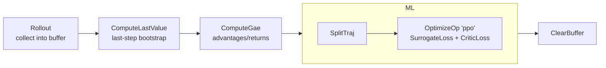
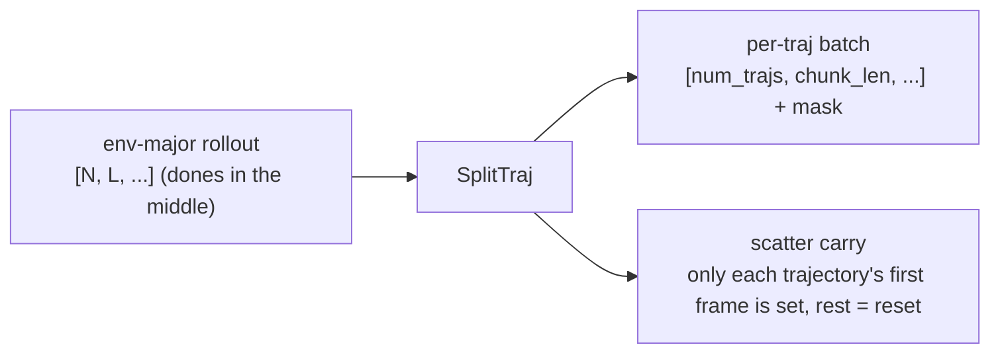

# PPO in practice

<span class="dx-eyebrow">Thunder</span>

This page grounds every concept so far in one real algorithm: **Recurrent PPO**, common in robot learning (and DexLab's default). We look at how its pipeline is assembled, what the key operators compute, how bounded actions are handled, and finally how to run it with `train.py` / `play.py`.

## One factory call brings up the whole pipeline

`PpoAgent.factory` starts from an environment and a `PpoAgentSpec` and assembles the models, buffer, executor, optimizer, scheduler, and the entire pipeline. Note its real return value — **it returns an `(agent, env)` tuple** (because when observation normalization is on it wraps env in a `NormalizeObsWrapper` and must hand the wrapped env back to you):

```python
agent, env = PpoAgent.factory(env, spec.agent)
```

The pipeline assembled inside the factory is the whole of PPO:

```python
agent.setup_pipeline([
    Rollout(env, agent, step=spec.rollout_steps),     # collect rollout_steps steps
    ComputeLastValue(env.autoreset_mode),             # estimate the last-step bootstrap value
    ComputeGae(gamma=spec.gamma, lambda_=spec.lambda_),# compute advantages / returns
    MiniBatchLoop(
        SequenceBatchSampler(spec.minibatch_size),
        pipeline=[
            SplitTraj(),                              # split trajectories (key to Recurrent PPO)
            OptimizeOp("ppo", (
                PpoSurrogateLoss(clip_ratio=spec.clip_ratio,
                                 entropy_coef=spec.entropy_coef),
                CriticLoss(weight=spec.value_loss_coef,
                           value_clip=spec.value_clip),
            ), max_grad_norm=spec.max_grad_norm),
        ],
        jit=True, epoch=spec.num_epochs,              # the whole inner mini-batch loop is JIT-compiled
    ),
    ClearBuffer(agent.buffer),                        # clear the buffer; on-policy
])
```



`MiniBatchLoop` is a `Pipeline` subclass: it uses `SequenceBatchSampler` to cut the buffer into mini-batches, runs the inner pipeline on each, and wraps that in `epoch` rounds. The inner pipeline sets `jit=True`, so the whole segment is compiled by `Executor.jit` (i.e. `torch.compile`).

## GAE: different bootstrap for terminated vs. timeout

The crux of `ComputeGae` is **distinguishing "true termination" from "timeout truncation"** — exactly the spot most often gotten wrong in robotics RL:

```python
bootstrap_continue = (~terminated).to(values.dtype)            # terminated -> no bootstrap
trace_continue     = (~(terminated | timeouts)).to(values.dtype)# terminated or timeout -> cut the trace

for step in reversed(range(L)):
    delta = rewards[:, step] \
          + gamma * bootstrap_continue[:, step] * next_values[:, step] \
          - values[:, step]
    advantage = delta + gamma * lambda_ * trace_continue[:, step] * advantage
    returns[:, step] = advantage + values[:, step]
```

- **terminated (a true terminal state)**: future value is 0, so `bootstrap_continue=0` and `delta` adds no `next_value`.
- **timeout (truncated only because the time limit was hit)**: the state itself did not end, so we should use the bootstrap value; therefore it does **not** mask `next_value` in `delta`, but uses `trace_continue=0` to cut the GAE recursion (so advantage does not propagate back across the truncation point).

Where does that `next_value` come from? The preceding operator `ComputeLastValue` prepares it: it shifts `values` left by one to get each step's `next_value`, computes the last step's bootstrap by running the critic on `cache.final.critic_carry`, zeroes terminated steps, and handles timeout steps according to the environment's `autoreset_mode`. Finally `ComputeGae` normalizes the advantage by default (subtract mean, divide by std).

## Recurrent PPO: SplitTraj cuts trajectories + scatters carry

Why is `SplitTraj` needed? Because the rollout in the buffer is **env-major**: shape `[N, L, ...]` (N parallel envs, L steps each), and a single env's timeline may span several episodes (dones in the middle). Feeding that straight into a recurrent network would let the hidden state bleed across episode boundaries. `SplitTraj` re-granulates it:

- **batch (dense per-step data `[N, L, ...]`)**: cut at each done, zero-pad each piece into `[num_trajs, chunk_len, ...]`, and produce a validity `mask`.
- **cache (sparse per-env snapshots `[N, ...]`, i.e. the recurrent carry)**: scatter each env's carry into its **first** trajectory and zero the rest — and that zero exactly equals the "reset carry" `agent.reset` applies at episode boundaries.



Only the "trajectory-start carry" is needed because a recurrent forward can regenerate all intermediate states from the initial one. `SplitTraj` does this with a pair of parallel `tree_map`s (`_split_leaf` for batch, `_scatter_leaf` for cache), **fully generic and never hard-coding any field name** — whoever put `policy_carry`/`critic_carry` into the cache reads it back in the loss. Downstream losses mask the padding throughout with `batch.mask`: `(loss * mask).sum() / mask_count`.

## Loss: clipping + masking

`PpoSurrogateLoss` is the standard clipped policy loss, but every term is multiplied by `mask`:

```python
ratio = torch.exp(log_prob - batch.log_prob)
unclipped = ratio * batch.advantages
clipped   = torch.clamp(ratio, 1 - clip_ratio, 1 + clip_ratio) * batch.advantages
surrogate = -(torch.minimum(unclipped, clipped) * mask).sum() / mask_count
loss = surrogate - entropy_coef * entropy_mean
```

It also writes the KL into `self.exports["kl"]` — that value is read by the adaptive learning-rate scheduler `AdaptiveKlSchedulerSpec` (`desired_kl` default 0.01) to auto-tune lr when KL drifts from target. `CriticLoss` is the value loss with value-clipping (`max(value_loss, clipped_value_loss)`), likewise mask-weighted.

## ScaledBeta: bounded actions, analytic, no post-hoc clamp

Robot actions are almost always bounded (joint limits). A common approach samples a Gaussian and then `clamp`s to `[-1, 1]`, but that makes the log_prob inconsistent with the actual action and biases the gradient. Thunder offers `ScaledBeta`: a `Beta(c1, c0)` (defined on `[0,1]`) mapped through a fixed affine transform onto `[low, high]`:

- **Bounded by construction**: samples always fall inside `[low, high]`, **needing no post-hoc clamp**.
- **Fully analytic**: `mean / std / var / entropy / log_prob / KL` all have closed forms (unlike a squashed Gaussian that relies on numerical approximation); the affine map's constant Jacobian cancels in the KL, leaving the unit-interval Beta KL.
- **Reparameterized sampling (rsample)**: a Beta is synthesized from two Gammas, `X = G1 / (G1 + G2)`, so gradients flow analytically.

```python
# Switch to bounded actions: replace the actor's distribution head with BetaHeadSpec
from thunder.nn.torch.distributions import BetaHeadSpec
spec.agent.actor.head = BetaHeadSpec(low=-1.0, high=1.0, concentration_offset=1.0)
```

`BetaHead` applies `softplus(x) + concentration_offset` to both concentrations and requires `concentration_offset >= 1`, guaranteeing a unimodal Beta (so `mode` is well-defined). The default distribution head is still `ConsistentNormalHead` (Gaussian with a learnable global std parameter); ScaledBeta is an explicit opt-in.

## Running it

The example below uses a **DexLab environment**, but Thunder is simulator-agnostic — it plugs into environments through `EnvLoaderSpec`, and DexLab is just one provider (others include Gymnasium, DeepMind Control, ManiSkill, MuJoCo/mjlab; see [Cooperation · Neither side is locked in](../concepts/data-flow.md)). Swap the loader and the same PPO pipeline still runs.

Train (from the DexLab repo root):

```bash
python examples/thunder/train.py --env.task DexLab-Repose-Cube-V12-v0 --env.num_envs 4096
```

Replay a trained policy:

```bash
python examples/thunder/play.py            # replays the latest checkpoint of the latest run under root by default
python examples/thunder/play.py --checkpoint best --explore false
```

The main loop is minimal — just repeated `agent.step()`:

```python
spec = Experiment.parse()
with DistributedContextManager() as dist, quiet_unless_main(dist):
    Experiment.bind(spec, dist)
    env = make_env(spec.env)
    spec = Experiment.apply_task_cfg(spec)        # merge in the task-side registered thunder cfg
    experiment = Experiment.start(spec, dist)
    agent, env = PpoAgent.factory(env, spec.agent)
    for _ in range(spec.iteration):
        metrics = agent.step()                    # one step = the whole PPO pipeline
        logger.log(metrics, agent.ctx.step)
```

## Where the hyperparameters live

`PpoAgentSpec` holds all of PPO's hyperparameters; the common ones:

| Field | Default | Meaning |
| --- | --- | --- |
| `gamma` / `lambda_` | 0.99 / 0.95 | GAE discount and trace decay |
| `clip_ratio` / `value_clip` | 0.2 / 0.2 | policy / value clipping range |
| `entropy_coef` / `value_loss_coef` | 0.0 / 0.5 | entropy bonus / value-loss weight |
| `num_epochs` | 5 | optimization rounds per rollout |
| `rollout_steps` / `minibatch_size` | 32 / 1024 | collection steps / mini-batch size |
| `lr` + `desired_kl` | 5e-4 / 0.01 | learning rate and adaptive-KL target |
| `actor` / `critic` | `ActorSpec` / `CriticSpec` | network structure (backbone + head + `obs_keys`) |

!!! tip "Don't tune hyperparameters in the algorithm repo"
    You should **not** edit `PpoAgentSpec`'s defaults to tune a task. A task's dedicated networks and hyperparameters are registered on the **environment side**: a DexLab task attaches a config (subclassing `ExperimentSpec`) via the gym registry's `thunder_cfg_entry_point`, and `Experiment.apply_task_cfg` merges it into the current spec after the app starts. Command-line `--agent.xxx` can still override temporarily. In short: **to change a task's training config, edit that task's `thunder_cfg`, not Thunder.** (For this wiring see [Concepts · How the pillars cooperate](../concepts/data-flow.en.md).)

---

You have now seen Thunder's full chain: from the "algorithm as pipeline" philosophy, through Operation / Pipeline and Agent / obs_keys, to PPO's real assembly. To build environments and feed data to algorithms, head to [DexLab](../dexlab/index.md); to revisit the three patterns running through everything, see [Concepts · Design patterns](../concepts/design-patterns.en.md).
