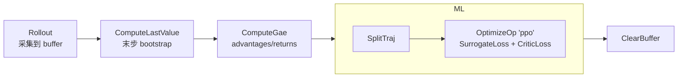
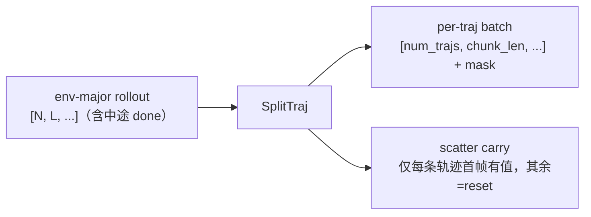

# PPO 实战

<span class="dx-eyebrow">Thunder</span>

这一页把前面所有概念落到一个真实算法上：机器人学习里常用的 **Recurrent PPO**（也是 DexLab 默认用的）。我们看它的流水线怎么组装、几个关键算子在算什么、有界动作怎么处理，最后怎么用 `train.py` / `play.py` 跑起来。

## 一行工厂，拉起整条流水线

`PpoAgent.factory` 从环境和一份 `PpoAgentSpec` 出发，把模型、buffer、executor、优化器、调度器、以及整条 pipeline 全部装好。注意它的真实返回值 —— **返回的是 `(agent, env)` 一个元组**（因为开启观测归一化时它会把 env 包一层 `NormalizeObsWrapper`，必须把包好的 env 还给你）：

```python
agent, env = PpoAgent.factory(env, spec.agent)
```

工厂内部组装的 pipeline 就是 PPO 的全貌：

```python
agent.setup_pipeline([
    Rollout(env, agent, step=spec.rollout_steps),     # 采集 rollout_steps 步
    ComputeLastValue(env.autoreset_mode),             # 估计末步 bootstrap value
    ComputeGae(gamma=spec.gamma, lambda_=spec.lambda_),# 算 advantages / returns
    MiniBatchLoop(
        SequenceBatchSampler(spec.minibatch_size),
        pipeline=[
            SplitTraj(),                              # 切轨迹（Recurrent PPO 的关键）
            OptimizeOp("ppo", (
                PpoSurrogateLoss(clip_ratio=spec.clip_ratio,
                                 entropy_coef=spec.entropy_coef),
                CriticLoss(weight=spec.value_loss_coef,
                           value_clip=spec.value_clip),
            ), max_grad_norm=spec.max_grad_norm),
        ],
        jit=True, epoch=spec.num_epochs,              # 整个 mini-batch 内循环被 JIT 编译
    ),
    ClearBuffer(agent.buffer),                        # 清空 buffer，on-policy
])
```



`MiniBatchLoop` 是一个 `Pipeline` 子类：它用 `SequenceBatchSampler` 把 buffer 切成 mini-batch，对每个 mini-batch 跑内层 pipeline，外面再套 `epoch` 轮。内层 pipeline 设 `jit=True`，整段被 `Executor.jit`（即 `torch.compile`）编译。

## GAE：terminated 与 timeout 的不同 bootstrap

`ComputeGae` 的精髓在于**区分"真终止"和"超时截断"**，这正是机器人 RL 里最容易写错的地方：

```python
bootstrap_continue = (~terminated).to(values.dtype)            # 终止 → 不 bootstrap
trace_continue     = (~(terminated | timeouts)).to(values.dtype)# 终止或超时 → 截断 trace

for step in reversed(range(L)):
    delta = rewards[:, step] \
          + gamma * bootstrap_continue[:, step] * next_values[:, step] \
          - values[:, step]
    advantage = delta + gamma * lambda_ * trace_continue[:, step] * advantage
    returns[:, step] = advantage + values[:, step]
```

- **terminated（真到了终止态）**：未来价值为 0，所以 `bootstrap_continue=0`，`delta` 不加 `next_value`。
- **timeout（仅因为到达时限被截断）**：状态本身没结束，应当用 bootstrap 价值；所以它**不**屏蔽 `delta` 里的 `next_value`，但用 `trace_continue=0` 切断 GAE 的递推链（不让优势跨越截断点回传）。

而那个 `next_value` 从哪来？由前一个算子 `ComputeLastValue` 准备：它把 `values` 左移一格得到每步的 `next_value`，末步用 critic 在 `cache.final.critic_carry` 上前向算出 bootstrap，终止步置 0，并按环境的 `autoreset_mode` 处理超时步。最后 `ComputeGae` 默认对 advantage 做标准化（减均值除标准差）。

## Recurrent PPO：SplitTraj 切轨迹 + 散播 carry

为什么需要 `SplitTraj`？因为 buffer 里的 rollout 是 **env-major** 的：形状 `[N, L, ...]`（N 个并行环境、各 L 步），一条环境时间线里可能跨了好几个 episode（中间有 done）。直接喂给 recurrent 网络会让 hidden state 跨越 episode 边界污染。`SplitTraj` 把它重新切粒度：

- **batch（稠密的逐步数据 `[N, L, ...]`）**：在每个 done 处切断，把每段零填充成 `[num_trajs, chunk_len, ...]`，并产出一个有效位 `mask`。
- **cache（稀疏的逐环境快照 `[N, ...]`，即 recurrent carry）**：把每个环境的 carry 散播进它的**第一条**轨迹，其余轨迹置零 —— 而置零恰好等于 `agent.reset` 在 episode 边界做的"重置 carry"。



之所以只需要"轨迹首帧的 carry"，是因为 recurrent 前向能从初始 state 重新生成中间所有 state。`SplitTraj` 用一对并行的 `tree_map`（`_split_leaf` 切 batch、`_scatter_leaf` 散 cache）做这件事，**完全泛型、不写死任何字段名** —— 谁往 cache 里放了 `policy_carry`/`critic_carry`，谁就在 loss 里读回它。下游 loss 全程用 `batch.mask` 屏蔽填充位：`(loss * mask).sum() / mask_count`。

## 损失：clipping + masking

`PpoSurrogateLoss` 是标准的裁剪式策略损失，但每一项都乘了 `mask`：

```python
ratio = torch.exp(log_prob - batch.log_prob)
unclipped = ratio * batch.advantages
clipped   = torch.clamp(ratio, 1 - clip_ratio, 1 + clip_ratio) * batch.advantages
surrogate = -(torch.minimum(unclipped, clipped) * mask).sum() / mask_count
loss = surrogate - entropy_coef * entropy_mean
```

它还把 KL 写进 `self.exports["kl"]` —— 这个值被自适应学习率调度器 `AdaptiveKlSchedulerSpec`（`desired_kl` 默认 0.01）读走，用来在 KL 偏离目标时自动调 lr。`CriticLoss` 则是带 value-clipping 的价值损失（`max(value_loss, clipped_value_loss)`），同样 mask 加权。

## ScaledBeta：有界动作，解析、无 post-hoc clamp

机器人动作几乎都是有界的（关节限位）。常见做法是用高斯采样后再 `clamp` 到 `[-1, 1]`，但这会让 log_prob 与实际动作不一致、梯度有偏。Thunder 提供 `ScaledBeta`：把 `Beta(c1, c0)`（定义在 `[0,1]`）经一个固定仿射映射到 `[low, high]`：

- **天生有界**：采样永远落在 `[low, high]` 内，**不需要任何事后裁剪**。
- **全程解析**：`mean / std / var / entropy / log_prob / KL` 全有闭式（不像 squashed Gaussian 要靠数值近似）；仿射映射的常数雅可比在 KL 里直接抵消，只剩单位区间 Beta 的 KL。
- **可重参数化采样（rsample）**：用两个 Gamma 合成 Beta，`X = G1 / (G1 + G2)`，梯度可解析回传。

```python
# 切到有界动作：把 actor 的分布头换成 BetaHeadSpec
from thunder.nn.torch.distributions import BetaHeadSpec
spec.agent.actor.head = BetaHeadSpec(low=-1.0, high=1.0, concentration_offset=1.0)
```

`BetaHead` 对两个浓度都做 `softplus(x) + concentration_offset`，并要求 `concentration_offset >= 1`，从而保证 Beta 单峰（`mode` 有良定义）。默认分布头仍是 `ConsistentNormalHead`（高斯，std 为可学习的全局参数）；ScaledBeta 是显式选项。

## 跑起来

下面**以 DexLab 环境为例**。但 Thunder 对仿真器无关 —— 它通过 `EnvLoaderSpec` 接入环境，DexLab 只是其中一个 provider（还有 Gymnasium、DeepMind Control、ManiSkill、MuJoCo/mjlab 等，见 [三包协作 · 两个方向都不绑死](../concepts/data-flow.md)）。换个 loader，同一套 PPO 流水线照样跑。

训练（DexLab 仓库根目录）：

```bash
python examples/thunder/train.py --env.task DexLab-Repose-Cube-V12-v0 --env.num_envs 4096
```

回放训练好的策略：

```bash
python examples/thunder/play.py            # 默认回放 root 下最新一次 run 的 latest checkpoint
python examples/thunder/play.py --checkpoint best --explore false
```

主循环极简，就是反复 `agent.step()`：

```python
spec = Experiment.parse()
with DistributedContextManager() as dist, quiet_unless_main(dist):
    Experiment.bind(spec, dist)
    env = make_env(spec.env)
    spec = Experiment.apply_task_cfg(spec)        # 合入任务侧注册的 thunder cfg
    experiment = Experiment.start(spec, dist)
    agent, env = PpoAgent.factory(env, spec.agent)
    for _ in range(spec.iteration):
        metrics = agent.step()                    # 一次 step = 整条 PPO 流水线
        logger.log(metrics, agent.ctx.step)
```

## 超参在哪配

`PpoAgentSpec` 持有 PPO 的全部超参，常用的几个：

| 字段 | 默认 | 含义 |
| --- | --- | --- |
| `gamma` / `lambda_` | 0.99 / 0.95 | GAE 折扣与迹衰减 |
| `clip_ratio` / `value_clip` | 0.2 / 0.2 | 策略 / 价值裁剪幅度 |
| `entropy_coef` / `value_loss_coef` | 0.0 / 0.5 | 熵奖励 / 价值损失权重 |
| `num_epochs` | 5 | 每次 rollout 的优化轮数 |
| `rollout_steps` / `minibatch_size` | 32 / 1024 | 采集步数 / mini-batch 大小 |
| `lr` + `desired_kl` | 5e-4 / 0.01 | 学习率与自适应 KL 目标 |
| `actor` / `critic` | `ActorSpec` / `CriticSpec` | 网络结构（骨干 + 头 + `obs_keys`） |

!!! tip "别在算法仓库里调超参"
    你**不应该**直接编辑 `PpoAgentSpec` 的默认值来调一个任务。任务专属的网络与超参注册在**环境侧**：DexLab 任务通过 gym 注册表的 `thunder_cfg_entry_point` 挂一份继承自 `ExperimentSpec` 的配置，`Experiment.apply_task_cfg` 在 app 启动后把它合并进当前 spec。命令行 `--agent.xxx` 仍可临时覆盖。换言之：**改一个任务的训练配置，去那个任务的 `thunder_cfg` 里改，而不是改 Thunder。**（这条接线见 [Concepts · 三包协作](../concepts/data-flow.md)。）

---

至此你已经看完 Thunder 的完整链路：从"算法即流水线"的哲学，到 Operation / Pipeline、Agent / obs_keys，再到 PPO 的真实组装。想造环境、给算法喂数据，转到 [DexLab](../dexlab/index.md)；想回顾三种贯穿全局的设计模式，看 [Concepts · 设计模式](../concepts/design-patterns.md)。
